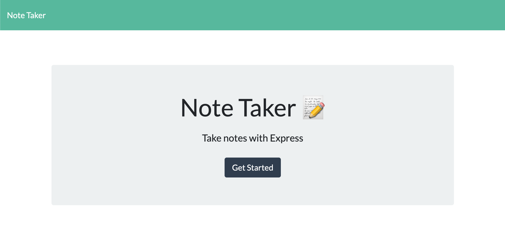
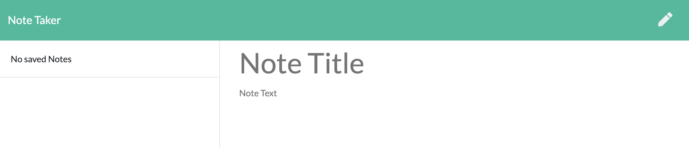
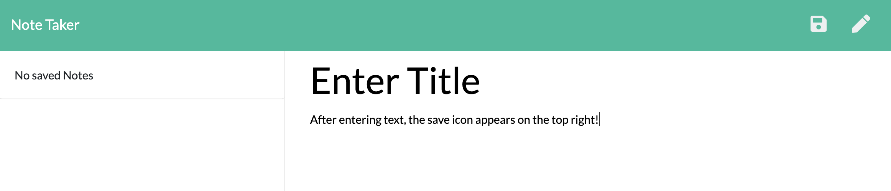
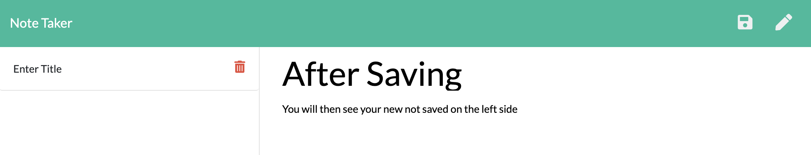
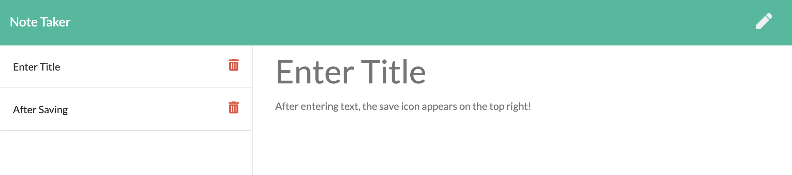

# Note Taker Application

[Deplayed Note Taker](https://note-taker-app-hw-u11.herokuapp.com/)

## Description

This application allows the user to write and save notes that can be retrieved to view or delete later.

## Usage

The user can write, save, and delete notes with this application.
To begin the user can navigate to the home page where they will click the "Get Started" button to be directed to the notes page.

Once on the notes page, the user can enter a title and content of the note in the text fields provided.

After filling both fields with content, the user will see a save icon appear in the top right corned of the page which can be clicked to store their note.

After saving, the note will populate the section on the left side of the page where they will see the title of the saved note.

After notes have been saved they can be clicked to have the content populate the page. They can then click the pencil on the top right to start a new note or use the trashcan icons on the list of saved notes to delete that individual note.

## Creating This Page

For this project, I worked on creating and hosting an Express server on Heroku. The main challenges I faced were through getting all of the files to communicate with each other using express and requiring files instead of hard-coding links between files as we have for everything before now. 

## Contributions

When contributing to this repository, please contact the owner of the repository before pushing any updates.
When contributions are accepted, please update the readme.md noting any changes that have been made.

## Authors and Acknowledgment

All files for this project were created and supplied by Georgia Tech Coding Boot Camp, except for the server.js file which was written by Raleigh Chesney.

NPMs:
* [Express](https://www.npmjs.com/package/express)
* [FS](https://www.npmjs.com/package/fs)
* [UUID](https://www.npmjs.com/package/uuid)
* [Path](https://www.npmjs.com/package/path)

Web Dev Tools:
* [Mozille Developer Network](https://developer.mozilla.org/en-US/)
* [Stack Overflow](https://stackoverflow.com/)
* [w3schools!](https://www.w3schools.com/bootstrap4/default.asp)

Thank you to all of my GT Bootcamp classmates who have offered advice and helped fix bugs alone the way.

Special thanks to Jonathan Watson and Peter Colella for instruction and help with my code.
## License

MIT License

Copyright (c) 2020 Raleigh Chesney

Permission is hereby granted, free of charge, to any person obtaining a copy
of this software and associated documentation files (the "Software"), to deal
in the Software without restriction, including without limitation the rights
to use, copy, modify, merge, publish, distribute, sublicense, and/or sell
copies of the Software, and to permit persons to whom the Software is
furnished to do so, subject to the following conditions:

The above copyright notice and this permission notice shall be included in all
copies or substantial portions of the Software.

THE SOFTWARE IS PROVIDED "AS IS", WITHOUT WARRANTY OF ANY KIND, EXPRESS OR
IMPLIED, INCLUDING BUT NOT LIMITED TO THE WARRANTIES OF MERCHANTABILITY,
FITNESS FOR A PARTICULAR PURPOSE AND NONINFRINGEMENT. IN NO EVENT SHALL THE
AUTHORS OR COPYRIGHT HOLDERS BE LIABLE FOR ANY CLAIM, DAMAGES OR OTHER
LIABILITY, WHETHER IN AN ACTION OF CONTRACT, TORT OR OTHERWISE, ARISING FROM,
OUT OF OR IN CONNECTION WITH THE SOFTWARE OR THE USE OR OTHER DEALINGS IN THE
SOFTWARE.

